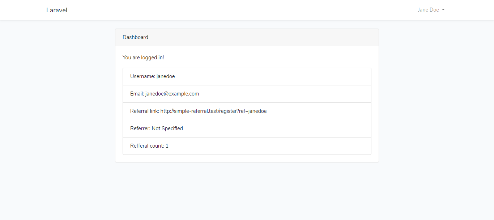

This project demos a super simple referral system built with Laravel. To read the tutorial I wrote for this, click [here](https://dev.to/simioluwatomi/let-s-build-a-super-simple-referral-system-with-laravel-1o3h)  .
 
 To run the project

- Clone it to your computer.
- Run `composer install` to install application dependencies.
- Copy `.env.example` to `.env`.
- Run `php artisan key:generate` to generate an application key.
- Add database credentials to `.env`.
- Run `php artisan migrate` to migrate the database.
- To run the tests included, add database credentials for the `testing` database connection defined in `config/database.php` to `.env`.

